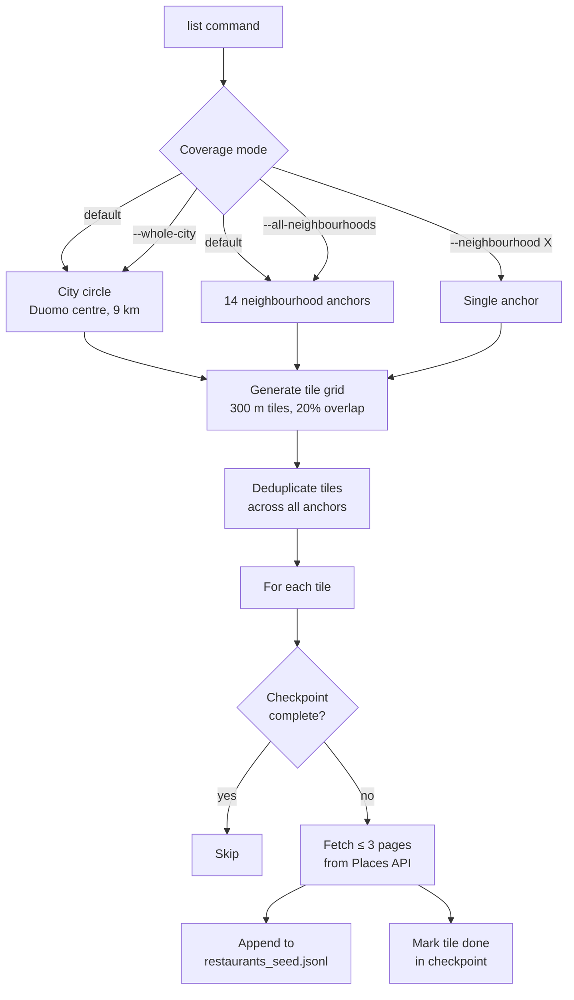

# Bicocca Data Management Project

## **Consistency and Quality of Online Restaurant Reviews in the Milan Area**


---


## 1️⃣ Domain & research questions

### Domain

Online restaurant review platforms provide ratings that strongly influence consumer behavior. However, ratings may differ across platforms due to **data quality issues**, **sampling bias**, or **integration errors**.

The project focuses on restaurants located in **Milan and surrounding municipalities**.

### Main research questions

> 1. **How consistent are restaurant ratings across different online platforms?**
> 2. **Which restaurants show the highest disagreement between platforms?**
> 3. **Is rating inconsistency related to data quality issues** (e.g. number of reviews, outdated information)?
> 4. **Can low-quality or sparse data inflate perceived restaurant quality?**

### Secondary questions

> * Are certain platforms systematically more optimistic/pessimistic?
> * Does inconsistency increase for smaller or less popular restaurants?
> * Does geographic location (center vs periphery) affect data completeness?

---


## 🛠 Setup

### Requirements

* Python 3.11+
* [`uv`](https://github.com/astral-sh/uv) package manager
* [Brave browser](https://brave.com/) (for Tripadvisor scraper)

### Install

```bash
uv sync --extra dev          # install runtime + dev dependencies
uv run pre-commit install    # (optional) install git hooks
uv run pytest                # run the test suite
```

### Configure API keys

```bash
printf "DATAMAN_GOOGLE_PLACES_API_KEY=your_key_here\n" > .env
```

The key must have **Places API (New)** enabled in Google Cloud
(*APIs & Services → Library → "Places API (New)" → Enable*) — the legacy
Places API will not work.

---


## 2️⃣ Data sources (FAQ 5 – acquisition)

### Source A — Google Maps / Google Places API

* **Type**: Official API via Places API
* **Example of features**:

  * Restaurant name
  * Address
  * Coordinates (lat/lon)
  * Rating
  * Number of reviews
  * Google place types and primary type
  * Optional full Place Details payload
* **Why**:

  * High coverage in Milan
  * Rich metadata
  * Coordinates become the project geographic backbone
* **Tools**:

  * Python + `httpx`
  * Tiled Nearby Search + Place Details
  * Raw JSONL seed output in `data/raw/google_places/restaurants_seed.jsonl`

#### Running the Google Places pipeline

**How it works**



The Places API caps each individual search to a circle of fixed radius. To cover
a large area, the pipeline **tiles** it: a square grid of overlapping circles is
laid over a larger outer circle, and each small circle becomes one API call.
Circle centres are spaced at `2 × search_radius_m × (1 − tile_overlap)` apart,
producing configurable overlap so no gap exists between adjacent tiles.

A single `list` run covers two kinds of area by default:

- **Whole-city circle** — one outer circle centred on Piazza del Duomo, tiled
  out to `DATAMAN_OUTER_RADIUS_M`.
- **Neighbourhood anchors** — smaller outer circles placed over Milan's
  restaurant-dense zones. Each anchor generates its own tile grid; grids are
  merged on a shared cell index so no tile is queried twice even when anchors
  overlap each other or the city circle.

**Commands**

```bash
uv run google-places-api-extract list          # collect seed venues
uv run google-places-api-extract detail --all  # enrich every seed venue with full Place Details
```

Both runs are idempotent — completed work is checkpointed and skipped on re-run.
Output lands in `data/raw/google_places/`. A JSON `ListReport` (`tiles_processed`,
`unique_places`, `pages_fetched`, `errors`) is printed to stdout after each `list` run.

> `google-places-api-extract list` ≡ `google-places-api-extract --mode list`, and likewise for `detail`.

**Flags**

`list` — controls geographic coverage (use at most one coverage flag):

| Flag | Default | Description |
|---|---|---|
| *(none)* | — | Whole-city circle + all neighbourhood anchors |
| `--whole-city` | — | Whole-city circle only |
| `--all-neighbourhoods` | — | All neighbourhood anchors only, no city circle |
| `--neighbourhood <name>` | — | Single named anchor (e.g. `navigli_1`) |
| `--max-results <n>` | unlimited | Stop once N unique venues have been collected |

`detail`:

| Flag | Default | Description |
|---|---|---|
| `--all` | — | Enrich every venue in the seed |
| `--place-id <id>` | — | Enrich a single venue |

Key parameters (set via `.env` or environment, all prefixed `DATAMAN_`):

| Variable | Default | Description |
|---|---|---|
| `OUTER_RADIUS_M` | `9000` | Radius of the whole-city circle (metres) |
| `SEARCH_RADIUS_M` | `300` | Radius of each tile / individual API search (metres) |
| `TILE_OVERLAP` | `0.2` | Overlap fraction between adjacent tiles (0 = no overlap) |
| `MAX_PAGES_PER_TILE` | `3` | Max result pages fetched per tile |
| `NEIGHBOURHOODS` | see below | JSON array to override built-in anchor list |

**Neighbourhood anchors**

The 14 built-in anchors cover Milan's highest restaurant-density zones. Each
anchor is an outer circle that is independently tiled with 300 m circles;
duplicate tiles across anchors or with the city circle are dropped automatically.

Anchors were chosen to saturate areas where density is too high for the 9 km
city circle alone to give full coverage within the API's per-search result cap.

| Quartiere | Anchor | Center | Outer radius |
|---|---|---|---|
| Duomo | `duomo` | [45.4642, 9.1900](https://www.google.com/maps/@45.4642,9.1900,17z) | 1 200 m |
| Navigli | `navigli_1` | [45.4520, 9.1760](https://www.google.com/maps/@45.4520,9.1760,17z) | 600 m |
| | `navigli_2` | [45.4485, 9.1720](https://www.google.com/maps/@45.4485,9.1720,17z) | 600 m |
| | `navigli_3` | [45.4450, 9.1680](https://www.google.com/maps/@45.4450,9.1680,17z) | 600 m |
| Brera | `brera` | [45.4720, 9.1880](https://www.google.com/maps/@45.4720,9.1880,17z) | 600 m |
| Isola | `isola` | [45.4870, 9.1880](https://www.google.com/maps/@45.4870,9.1880,17z) | 600 m |
| Porta Venezia | `porta_venezia_1` | [45.4740, 9.2050](https://www.google.com/maps/@45.4740,9.2050,17z) | 600 m |
| | `porta_venezia_2` | [45.4790, 9.2110](https://www.google.com/maps/@45.4790,9.2110,17z) | 600 m |
| Porta Romana | `porta_romana_1` | [45.4540, 9.2010](https://www.google.com/maps/@45.4540,9.2010,17z) | 600 m |
| | `porta_romana_2` | [45.4490, 9.2050](https://www.google.com/maps/@45.4490,9.2050,17z) | 600 m |
| Sempione | `sempione_1` | [45.4790, 9.1740](https://www.google.com/maps/@45.4790,9.1740,17z) | 600 m |
| | `sempione_2` | [45.4830, 9.1680](https://www.google.com/maps/@45.4830,9.1680,17z) | 600 m |
| | `sempione_3` | [45.4870, 9.1620](https://www.google.com/maps/@45.4870,9.1620,17z) | 600 m |
| Loreto | `loreto` | [45.4860, 9.2160](https://www.google.com/maps/@45.4860,9.2160,17z) | 600 m |

To replace the list set `DATAMAN_NEIGHBOURHOODS` to a JSON array of
`{name, lat, lon, outer_radius_m}` objects, or `[]` to disable anchors entirely.

**Examples**

Smoke test — ~10 venues around [Piazza del Duomo](https://maps.app.goo.gl/SKDd7SXBBNPgVM9Y7):

```bash
echo "DATAMAN_OUTER_RADIUS_M=500" >> .env
uv run google-places-api-extract list --whole-city --max-results 10
```

Full production run (target ≥ 500 venues):

```bash
uv run google-places-api-extract list
uv run google-places-api-extract detail --all
```

Single neighbourhood:

```bash
uv run google-places-api-extract list --neighbourhood navigli_1
```

Inspect the collected seed:

```bash
head data/raw/google_places/restaurants_seed.jsonl | uv run python -c \
  "import sys, json; [print(json.loads(l)['name'], '—', json.loads(l)['formatted_address']) for l in sys.stdin]"
```

**How the current seed dataset was collected**

The seed was built in three passes, each targeting the Duomo centre with a
progressively smaller tile radius to fill gaps left by earlier runs:

| Pass | Tile radius | Area | Rationale |
|---|---|---|---|
| 1 | 750 m | Whole-city circle around Duomo | Broad initial sweep across the city |
| 2 | 300 m | Whole-city circle around Duomo | Finer tiling to recover venues missed by the coarser pass |
| 3 | 100 m | Dense neighbourhood anchors only | Fine-grained sweep in high-density zones where saturation was still uncertain |

Results from all three passes are deduplicated by `place_id` in the seed file.

**Errors**

- 4xx → `PermanentPlacesError`, not retried.
- 429 / 5xx → retried up to 5× with exponential backoff.
- Failed venues are logged with `place_id` and reason; the run continues.

---

### Source B — Tripadvisor

* **Type**: Web scraping via Playwright
* **Data**:

  * Scraped restaurant name
  * Address
  * Rating
  * Review count
  * Optional review text / recency fields
* **Why**:

  * Different user base from Google
  * Useful for cross-platform rating consistency analysis

#### Running the Tripadvisor scraper

The scraper is packaged as `src/tripadvisor_scraper_extract`. Runtime files are
written under `data/raw/tripadvisor/`; the bundled restaurant URL list is copied
there on first run if no URL file exists yet. See
`docs/tripadvisor_scraper_extractor/tripadvisor-scraper-extract.md` for runtime
paths and browser setup details.

```bash
uv run tripadvisor-scraper-extract --order bottom
```

Use `--order bottom` when another teammate is scraping from the top of the URL
list. The default is `--order top`. The scraper auto-detects Brave on macOS,
Windows, and Linux; pass `--brave-path <path>` if Brave is installed somewhere
non-standard.

---

### Source C — TheFork (planned)

* **Type**: Web scraping or another reproducible acquisition path
* **Data**:

  * Scraped restaurant name
  * Address
  * Rating
  * Review count
  * Optional booking/price metadata
* **Why**:

  * Restaurant-specific platform
  * Useful comparison against review-heavy general platforms

---


## 3️⃣ Data storage & modeling (FAQ 6)

### Current raw acquisition persistence

Downloaded/acquired data is treated as raw acquisition output and kept under
`data/raw/`.

**Google Places: `data/raw/google_places/`**

* `restaurants_seed.jsonl`: one JSON object per Google place
* `checkpoints/`: list/detail resume state
* seed records are deduplicated by `place_id` and include raw `details` after enrichment

**Tripadvisor: `data/raw/tripadvisor/`**

* `tripadvisor_list_restaurant.txt`: URL list
* `tripadvisor_scraper_results.json`: raw scraper output
* `tripadvisor_checkpoint.json`: scraper resume state
* `brave_automation_profile/`: persistent browser profile

Database/storage implementation for later stages is intentionally deferred. The
candidate DBMS architecture is documented in `docs/storage-design.md`, but it is
not part of the current Stage 1 scope.

### Future storage shape

**restaurants_raw_google**

* place_id
* name
* address
* lat, lon
* rating
* review_count
* types / primary_type
* raw details document

**restaurants_raw_tripadvisor**

* tripadvisor_id
* name
* address
* rating
* review_count
* raw scraped payload

**restaurants_raw_thefork**

* thefork_id
* name
* address
* rating
* review_count
* raw scraped payload

**restaurants_integrated**

* unified_restaurant_id
* google_place_id
* tripadvisor_id
* thefork_id
* canonical_name
* canonical_address
* lat, lon
* google_rating
* tripadvisor_rating
* thefork_rating
* rating_difference
* data_quality_score

### Mandatory queries (examples)

* Restaurants with **rating difference > 1 star**
* Average rating per platform by area
* Correlation between review count and rating variance

---

## 4️⃣ Data profiling & quality assessment 

### Profiling before integration

For each source:

* **Completeness**:

  * % missing addresses
  * % missing coordinates
* **Consistency**:

  * Rating ranges
* **Timeliness** (if available):

  * Last review date

### Profiling after integration

* % restaurants matched successfully
* % ambiguous matches
* % unmatched records

### Data quality dimensions used

* Completeness
* Consistency
* Accuracy (proxy via cross-platform agreement)
* Timeliness
* Uniqueness (duplicates)

---

## 5️⃣ Data integration & enrichment

### Core challenge: entity matching (record linkage)

Restaurants do **not share IDs** → you must resolve them.

### Matching strategy (automated)

1. **Blocking**:

   * Same city
   * Distance < 200 meters
2. **Similarity metrics**:

   * Name similarity (Levenshtein / Jaro-Winkler)
   * Address similarity
3. **Composite matching score**
4. **Threshold-based decision**:

   * Match
   * No match
   * Uncertain

### Measuring integration errors

* False matches
* Missed matches
* Ambiguous matches


---

## 6️⃣ Data quality improvement

Concrete, visible improvements:

* Remove duplicates
* Normalize restaurant names
* Address standardization
* Filter restaurants with too few reviews
* Weighted ratings based on review count

We can show **before vs after**:

* Rating variance
* Number of extreme outliers

---

## 7️⃣ Analysis & results

### Analyses you can present

* Distribution of rating differences
* Platform bias comparison
* Rating stability vs review volume
* Spatial visualization of inconsistent restaurants

### Example insights (expected)

* Restaurants with <20 reviews show higher variance
* One platform may be systematically more conservative than another
* Peripheral areas have lower data completeness
