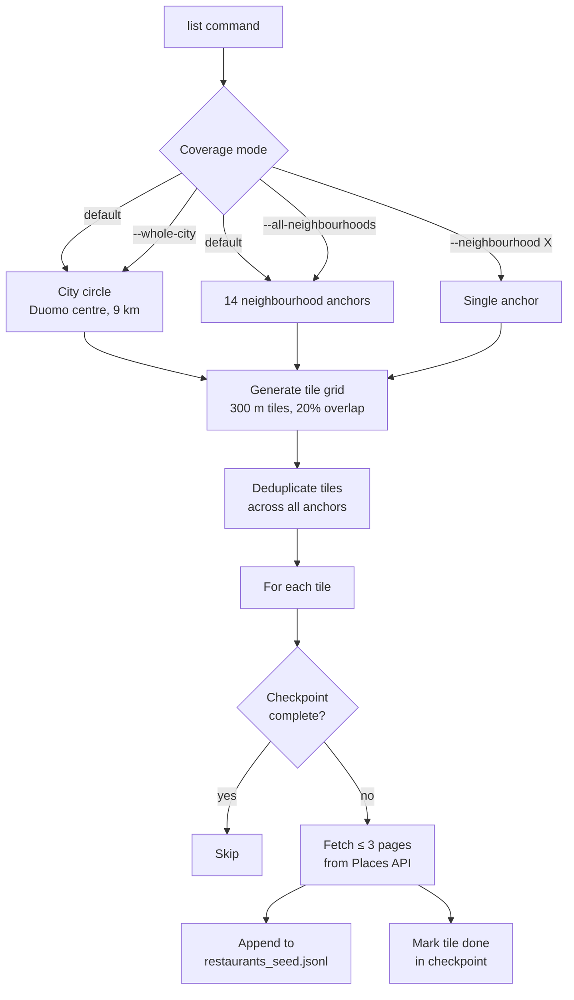

# Google Places API Extract

Python pipeline that collects Milan restaurant data from the Google Places API (New).
It first tiles the city with overlapping circular searches to build a seed list, then
optionally enriches each venue with full Place Details.

See [`dataset-schema.md`](dataset-schema.md) for the complete field reference and
[`stage1-seed-acquisition.md`](stage1-seed-acquisition.md) for methodology notes.

## How it works

The Places API limits each search to one circle. The pipeline covers a large area by
**tiling**: a square grid of overlapping circles (each = one API call) is laid over a
larger outer circle. Tile centres are spaced at `2 × search_radius_m × (1 − tile_overlap)`
so adjacent tiles always overlap and leave no gaps. By default, two sets of circles are
combined — the whole-city circle around [Piazza del Duomo](https://maps.app.goo.gl/JbCdRGcGgxWuQ5gf9)
and per-neighbourhood anchors — deduplicated on a shared cell grid so no tile is queried twice.



## Commands

```bash
uv run google-places-api-extract list          # collect seed venues
uv run google-places-api-extract detail --all  # enrich every seed venue with full Place Details
```

Both runs are idempotent — completed work is checkpointed and skipped on re-run.
Output lands in `data/raw/google_places/`. A JSON `ListReport` (`tiles_processed`,
`unique_places`, `pages_fetched`, `errors`) is printed to stdout after each `list` run.
`detail` takes `--all` to enrich every venue or `--place-id <id>` for a single one.

## Flags

`list` — controls geographic coverage (use at most one coverage flag):

| Flag | Default | Description |
|---|---|---|
| *(none)* | — | Whole-city circle + all neighbourhood anchors |
| `--whole-city` | — | Whole-city circle only |
| `--all-neighbourhoods` | — | All neighbourhood anchors only, no city circle |
| `--neighbourhood <name>` | — | Single named anchor (e.g. `navigli_1`) |
| `--max-results <n>` | unlimited | Stop once N unique venues have been collected |

Key parameters (set via `.env` or environment, all prefixed `DATAMAN_`):

| Variable | Default | Description |
|---|---|---|
| `OUTER_RADIUS_M` | `9000` | Radius of the whole-city circle (metres) |
| `SEARCH_RADIUS_M` | `300` | Radius of each tile / individual API search (metres) |
| `TILE_OVERLAP` | `0.2` | Overlap fraction between adjacent tiles (0 = no overlap) |
| `MAX_PAGES_PER_TILE` | `3` | Max result pages fetched per tile |
| `NEIGHBOURHOODS` | see below | JSON array to override built-in anchor list |

## Neighbourhood anchors

Anchors were chosen to saturate areas where restaurant density is too high for the 9 km
city circle alone to give full coverage within the API's per-search result cap.

| Quartiere | Anchor | Center | Outer radius |
|---|---|---|---|
| [Duomo](https://maps.app.goo.gl/JbCdRGcGgxWuQ5gf9) | `duomo` | [45.4642, 9.1900](https://www.google.com/maps/@45.4642,9.1900,17z) | 1 200 m |
| [Navigli](https://maps.app.goo.gl/ah6qT4aN4GUtav9C6) | `navigli_1` | [45.4520, 9.1760](https://www.google.com/maps/@45.4520,9.1760,17z) | 600 m |
| | `navigli_2` | [45.4485, 9.1720](https://www.google.com/maps/@45.4485,9.1720,17z) | 600 m |
| | `navigli_3` | [45.4450, 9.1680](https://www.google.com/maps/@45.4450,9.1680,17z) | 600 m |
| [Brera](https://maps.app.goo.gl/HYmEG5Rx466eduzE8) | `brera` | [45.4720, 9.1880](https://www.google.com/maps/@45.4720,9.1880,17z) | 600 m |
| [Isola](https://maps.app.goo.gl/rrGB9jKoruze6WK29) | `isola` | [45.4870, 9.1880](https://www.google.com/maps/@45.4870,9.1880,17z) | 600 m |
| [Porta Venezia](https://maps.app.goo.gl/PmXW4kMXnwQYmdwc8) | `porta_venezia_1` | [45.4740, 9.2050](https://www.google.com/maps/@45.4740,9.2050,17z) | 600 m |
| | `porta_venezia_2` | [45.4790, 9.2110](https://www.google.com/maps/@45.4790,9.2110,17z) | 600 m |
| [Porta Romana](https://maps.app.goo.gl/YHZb2MRvZu1C5rVe8) | `porta_romana_1` | [45.4540, 9.2010](https://www.google.com/maps/@45.4540,9.2010,17z) | 600 m |
| | `porta_romana_2` | [45.4490, 9.2050](https://www.google.com/maps/@45.4490,9.2050,17z) | 600 m |
| [Sempione](https://maps.app.goo.gl/JvBLmaWkqBdv6dHg6) | `sempione_1` | [45.4790, 9.1740](https://www.google.com/maps/@45.4790,9.1740,17z) | 600 m |
| | `sempione_2` | [45.4830, 9.1680](https://www.google.com/maps/@45.4830,9.1680,17z) | 600 m |
| | `sempione_3` | [45.4870, 9.1620](https://www.google.com/maps/@45.4870,9.1620,17z) | 600 m |
| [Loreto](https://maps.app.goo.gl/kZLEfwe659zfKU4N6) | `loreto` | [45.4860, 9.2160](https://www.google.com/maps/@45.4860,9.2160,17z) | 600 m |

To replace the list set `DATAMAN_NEIGHBOURHOODS` to a JSON array of `{name, lat, lon, outer_radius_m}` objects, or `[]` to disable anchors entirely.

## Examples

Smoke test — ~10 venues around [Piazza del Duomo](https://maps.app.goo.gl/SKDd7SXBBNPgVM9Y7):

```bash
echo "DATAMAN_OUTER_RADIUS_M=500" >> .env
uv run google-places-api-extract list --whole-city --max-results 10
```

Full production run (target ≥ 500 venues):

```bash
uv run google-places-api-extract list
uv run google-places-api-extract detail --all
```

Single neighbourhood:

```bash
uv run google-places-api-extract list --neighbourhood navigli_1
```

## Output

```text
data/raw/google_places/restaurants_seed.jsonl   # one JSON object per venue
data/raw/google_places/checkpoints/             # resume state for list and detail runs
```

## Errors

- 4xx → `PermanentPlacesError`, not retried.
- 429 / 5xx → retried up to 5× with exponential backoff.
- Failed venues are logged with `place_id` and reason; the run continues.
