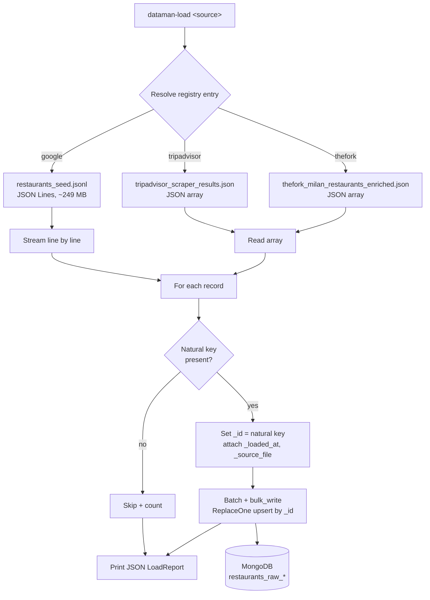

# Mongo Load

The **Load** layer of the project's **ELT** (Extract → Load → Transform) pipeline. Its
single job is to move the already-extracted raw files from `data/raw/` into **MongoDB**
as a **pure raw passthrough** — no parsing, normalization, deduplication, or enrichment.
All transformation is deferred to later stages that operate on MongoDB.

See [`specs/storage-load-layer.md`](../../specs/storage-load-layer.md) for the full
design rationale and [`docs/etl-design.md`](../../docs/etl-design.md) for where this layer
sits in the wider pipeline.

## How it works

The three extractors produce raw files in different shapes (JSON Lines vs a single JSON
array) keyed on different natural identifiers. Rather than three bespoke loaders, this
package has **one generic loader** driven by a small per-source **registry**: the only
real differences between sources are *data* (file path, on-disk format, natural key,
destination collection), expressed as configuration in
[`sources.py`](sources.py).

Each source has a verified-unique, non-null natural key, which becomes the MongoDB
document `_id`. Using the natural key as `_id` gives **idempotent upserts** (an *upsert*
updates the matching document if it already exists, otherwise inserts it) and uniqueness
for free — re-running a load never creates duplicates.



The large Google JSONL file is **streamed line by line** so it is never fully
materialized in memory; the smaller array files (≤ 49 MB) are read whole. Records are
upserted in **batches** via `bulk_write` (at most `batch_size` prepared docs are held at
once, keeping memory bounded while minimizing server round-trips).

## Prerequisites

MongoDB must be running (it ships as Docker infrastructure):

```bash
docker compose up -d mongo   # MongoDB on localhost:27017
```

This package runs on the host and does **not** require a Google Places API key. Run the
commands **from the repository root** — the source file paths in the registry are relative
to the current working directory.

## Commands

```bash
uv run dataman-load google         # load the Google Places seed
uv run dataman-load tripadvisor    # load the Tripadvisor scrape
uv run dataman-load thefork        # load the TheFork scrape
uv run dataman-load all            # load every source, then print a total
```

Every run is idempotent — re-loading converges to the same collection contents with no
duplicates. After each source a JSON `LoadReport` is printed to stdout
(`read`, `inserted`, `modified`, `skipped`, `skipped_reasons`); `all` also prints a final
`total`.

## Sources

| Source | Raw file | Format | Natural key (→ `_id`) | Destination collection |
|---|---|---|---|---|
| `google` | `data/raw/google_places/restaurants_seed.jsonl` | JSON Lines | `place_id` | `restaurants_raw_google` |
| `tripadvisor` | `data/raw/tripadvisor/tripadvisor_scraper_results.json` | JSON array | `source_url` | `restaurants_raw_tripadvisor` |
| `thefork` | `data/raw/thefork/thefork_milan_restaurants_enriched.json` | JSON array | `source_id` | `restaurants_raw_thefork` |

## Flags

| Flag | Default | Description |
|---|---|---|
| `--reset` / `--drop` | off | Empty the destination collection before loading (destructive). Default behaviour is non-destructive idempotent upsert. |

Configuration (set via `.env` or environment, all prefixed `DATAMAN_`):

| Variable | Default | Description |
|---|---|---|
| `MONGO_URI` | `mongodb://localhost:27017` | MongoDB connection string |
| `MONGO_DB` | `dataman` | Target database name |

## Load metadata

Records are stored exactly as parsed, plus a few **reserved** underscored keys that are
clearly load metadata, not source data:

| Key | Description |
|---|---|
| `_id` | The source's natural key (see table above) |
| `_loaded_at` | UTC timestamp of the load |
| `_source_file` | Path of the raw file the record came from |

These keys are reserved: a source field with the same name would be overwritten. The
current raw files contain none of them, so raw fidelity is preserved in practice.

## Output

```text
mongodb://localhost:27017 → dataman
  ├── restaurants_raw_google        # one doc per place_id
  ├── restaurants_raw_tripadvisor   # one doc per source_url
  └── restaurants_raw_thefork       # one doc per source_id
```

## Edge cases

- **Missing raw file** → fail fast with the expected path; non-zero exit (for `all`, names
  the missing source).
- **Unknown source selector** → usage error listing valid choices; non-zero exit.
- **Malformed JSONL line** → skipped, counted (`skipped_reasons.malformed_line`), logged
  with its line number; the rest of the file still loads.
- **Corrupt or non-array JSON file** (array sources) → cannot recover individual records,
  so it fails fast with a clear error naming the file; non-zero exit.
- **Record missing the natural key** (null/empty) → skipped and counted
  (`skipped_reasons.missing_key`) rather than letting Mongo auto-assign an ObjectId.
- **Duplicate keys within one file** → last-write-wins; one document per key.
- **Empty raw file** → completes with a zero-count summary, not an error.
- **MongoDB unreachable** → clear connection error, non-zero exit (does not hang).

## Testing

Two tiers under `tests/mongo_load/`:

- **Unit tests** (`test_loader.py`, `test_cli.py`, `test_config_sources.py`) run against
  in-memory **`mongomock`** — fast, no Docker. They inject the `serial_upsert` writer
  because mongomock 4.3.0 cannot execute `bulk_write` (it rejects the `sort` kwarg pymongo
  injects; fixed only on mongomock's unreleased `develop`). `serial_upsert` produces
  identical collection state, so all load logic is covered.
- **Integration test** (`test_integration.py`) runs the **default batched `bulk_write`
  path against a real MongoDB** (`DATAMAN_MONGO_URI`, default `localhost:27017`). It
  **auto-skips** when no server is reachable, so the default suite stays green without
  Docker. To run it: `docker compose up -d mongo && uv run pytest tests/mongo_load`.
